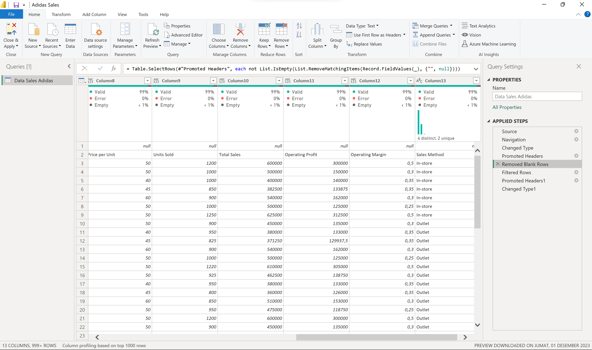
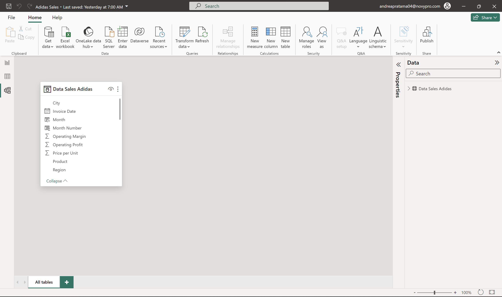
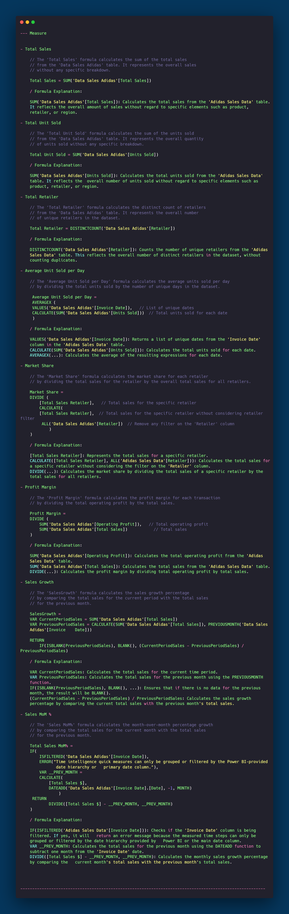
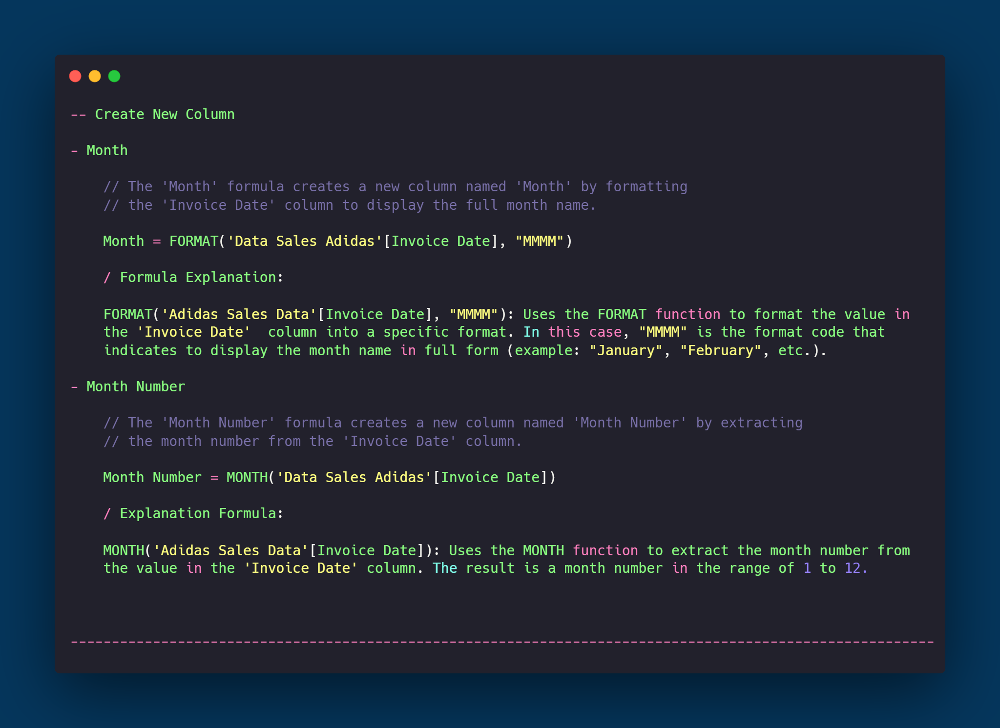

# Adidas Sales Report

## Introduction
Welcome to the Adidas Sales Analysis project! This project aims to provide a comprehensive analysis of Adidas sales data through the lens of a Power BI dashboard. The objective is to derive valuable insights into sales trends, regional performance, and product analytics to inform strategic decision-making.

## Problem Statement
The retail business landscape is dynamic, and understanding sales dynamics is crucial for optimizing revenue and identifying growth opportunities. This project addresses the need for a centralized and visually intuitive platform to analyze Adidas sales data.

## Skills Demonstrated
- **Power BI:** Proficiently used Power BI for creating interactive and insightful dashboards.
- **DAX (Data Analysis Expressions):** Applied DAX formulas for data transformation and measure creation.
- **Filters**
- **Button**
- **Data Transformation Techniques**
- **Modeling for Insightful Analytics**
- **PageNavigation**

## Data Sourcing
The dataset used in this project was sourced from Kaggle, providing a rich and accurate representation of Adidas sales data.

## Data Transformation
Performed necessary data transformations to prepare the dataset for analysis, including cleaning, handling missing values, and formatting.

## Modeling
In this project, the emphasis was on leveraging Data Analysis Expressions (DAX) to create impactful measures and new columns rather than establishing relationships between tables. The modeling phase involved the strategic development of DAX formulas to derive insightful metrics and enhance the dataset for meaningful analysis.

### DAX Measures
Utilized DAX measures to calculate key performance indicators (KPIs) such as Sales Growth, Profit Margin, and Total Sales etc. These measures play a crucial role in providing a nuanced understanding of the sales landscape.

### New Columns
Introduced new columns using DAX to enhance the dataset's granularity. For instance, the creation of 'Month Number' and 'Month' columns facilitated more detailed temporal analysis.

The modeling approach adopted in this project emphasizes the power and flexibility of DAX in deriving actionable insights without the need for complex table relationships.

## Analyze & Visualization
Developed compelling visualizations and utilized DAX measures to analyze sales trends, profit margins, and growth indicators. The dashboard provides a user-friendly interface for stakeholders to gain actionable insights.

- Retailer Performance Analysis
The dashboard includes a detailed analysis of retailer performance, allowing stakeholders to evaluate key metrics such as total sales, units sold, and profitability. Visualizations provide insights into the top-performing retailers and areas for improvement.

- Product Insights
Uncover the secrets of product performance by identifying best-sellers and products that significantly contribute to total sales. The dashboard visualizes product-related metrics to guide inventory management and marketing strategies.

- Region and City Analysis
Explore the geographical impact on sales by analyzing different regions and cities. Visualizations offer a clear overview of sales performance across locations, enabling strategic decisions based on regional trends.

- Sales Method Analysis
Understand the effectiveness of different sales methods on overall sales and profitability. Visual representations aid in identifying the most successful sales approaches and areas that may require optimization.

- Identify Time Trends
The dashboard incorporates time-based visualizations to help identify trends in sales over different periods. This analysis supports forecasting and decision-making for future sales strategies.

- Margin and Profit Monitoring
Efficiently monitor operating margins and operating profits through visualizations. This ensures a comprehensive understanding of the financial health of the business and enables timely adjustments to maintain profitability.

The comprehensive analysis and visualizations provided in this dashboard empower users to make informed decisions across various aspects of the business.

### This Report Have 2 Page :
- Dashboard Overview
- Retailer

### You can interact with report here _[Novypro](https://www.novypro.com/project/adidas-sales)_

## Conclusion & Recommendation
The Adidas Sales Analysis project has provided invaluable insights into the retail landscape, unraveling nuanced details about sales trends, retailer performance, and product dynamics. The utilization of Power BI, coupled with Data Analysis Expressions (DAX), has proven instrumental in crafting a comprehensive dashboard that goes beyond surface-level analytics.

### Key findings from the analysis include:

- Retailer Performance: Identification of top-performing retailers based on total sales, units sold, and profitability, enabling strategic collaboration and optimization efforts.
- Product Insights: In-depth knowledge of best-selling products and their impact on total sales, guiding inventory management and marketing initiatives.
- Region and City Analysis: Understanding geographical influences on sales, providing a foundation for localized marketing strategies and inventory planning.
- Sales Method Analysis: Evaluation of the effectiveness of sales methods, offering insights into refining strategies for enhanced overall sales and profitability.
- Time Trends: Recognition of temporal trends in sales, facilitating proactive decision-making and forecasting for future sales strategies.
- Margin and Profit Monitoring: Continuous monitoring of operating margins and profits, ensuring a financially sound business operation.

### Recomendation :

- Retailer Collaboration: Strengthen ties with top retailers through tailored collaborations.
- Product Portfolio Optimization: Focus on and expand offerings of best-selling products.
- Localized Marketing: Tailor marketing strategies based on regional nuances.
- Sales Method Refinement: Continuously refine sales methods for optimal impact.
- Proactive Time-Based Planning: Anticipate seasonal trends for proactive planning.
- Financial Health Checks: Regularly monitor and maintain healthy financial performance.

----------------------------------------------------------------------------------------------------------------------------------------------------------------------------------------------------
